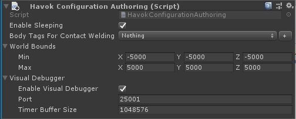

# Configuring the Simulation

The Havok Physics for Unity simulation offers some extra configuration options not found in the standard Unity Physics simulation.

To configure the simulation, either:
* Add a `HavokConfiguration` component to any entity in code, or
* Add a `Havok Configuration Authoring` and a `Convert to Entity` component to any game object in the editor

  

## Sleeping

By default the Havok Physics simulation "deactivates" any dynamic rigid bodies that have come to rest (also known as "sleeping"), and wake them automatically as needed.
This gives a large performance boost.
You can disable this behavior if you wish, but this is typically only recommended for testing purposes.

## Contact Point Welding

Geometrically, the separating axis between two shapes is not guaranteed to allow for smooth movement over their faces -- i.e. for a box sitting on a mesh, it's likely that the closest point on nearby triangles is the triangle edge.

This can cause issues when you have a fast moving body sliding over another body, resulting in "ghost collisions" where the objects can be deflected away from each other when they should have slid over or past each other.

Havok Physics for Unity offers a solution to this problem, known as contact point "welding" - this examines the predicted path of the rigid body, and the nearby colliders, in order to build contact points which better reflect the predicted motion for that step.

Contact point welding is not enabled by default since it adds some performance overhead. To enable it, you must:
* Assign any _Custom Body Tag_ of your choosing on all `Physics Body` components that you want to enable this behavior.
* Assign that same tag in the _Body Tags for Contact Welding_ field of the `HavokConfiguration` component.

Please see the "VehicleOverTerrain" scene in the Unity Physics sample scenes to illustrate how contact point welding improves behavior.

## World Bounds

Havok Physics for Unity currently requires a defined world extent.
Please ensure this bounding box is large enough to encompass all your rigid bodies, otherwise any bodies outside of those bounds will not collide correctly.

## Havok Visual Debugger

The Havok Visual Debugger is disabled by default since it opens a network socket and incurs a little performance overhead.
Enable it by adding a `Havok Configuration` component and toggling the _Enable Visual Debugger_ field.

See the [Havok Visual Debugger](vdb_quickstart.md) section for more information on how to use the Visual Debugger application.
