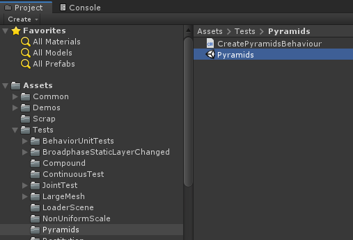

# Quick start guide for Havok Physics

This guide aims to get you up and running as quickly as possible with Havok Physics for Unity.

The steps below make use of the Unity Physics Samples publicly available on GitHub (see the Unity Physics Samples [documentation](https://github.com/Unity-Technologies/EntityComponentSystemSamples/blob/master/UnityPhysicsSamples/Documentation/samples.md) for more details).

## Adding the Havok Physics for Unity package

1. Get the [Unity Physics Samples](https://github.com/Unity-Technologies/EntityComponentSystemSamples/) if you don't already have them.  
1. Open the `UnityPhysicsExample` project  
1. Add the **Havok Physics** package..  
    
    ##### ..via Package Manager  
    1. Open Unity's Package Manager from the _Window_ > _Package Manager_ menu item 
    1. With *All packages* toggled, select and install **Havok Physics**. Note that the *Install* button is at the bottom right of the window.  
    
    
    ##### ..or via zip download
    1. If receiving the packages outside of the package manager unzip Havok.Physics.zip to desired package directory outside of the new clone directory e.g. D:\\Packages\\ 
    1. Locally modify the [samples project's manifest](https://github.com/Unity-Technologies/EntityComponentSystemSamples/blob/master/UnityPhysicsSamples/Packages/manifest.json) to add this package as a dependency.  
        ```
        "dependencies": {
        ...
        "com.havok.physics": "file:D:/Packages/Havok.Physics/com.havok.physics",
        ...
        }
        ```

1. Ensure the **Havok Physics** plugin is installed by checking in the *Packages* subfolder.  
    

## Change a scene to simulate with Havok Physics for Unity instead of Unity Physics

1. Open the `Pyramids` test scene located in _Assets\Tests\Pyramids_.  
    
1. Press *Play* to simulate the scene using the stateless **Unity Physics** backend.
    
1. Stop the simulation to reset the pyramid stack.
1. Examine the `Physics Scene Basic Elements` node in the scene hierarchy.
1. Select the `Physics Settings` node.
1. In the inspector, change the _Simulation Type_ of the `Physics Step` component from **Unity Physics** to **Havok Physics**.   
      
    Note: the _Simulation Type_ in the `Physics Step` component can also be toggled at runtime as well.
1. Press *Play* to simulate the scene using the **Havok Physics** backend.
    
1. In the _Game_ tab use the left mouse button (LMB) to click and drag dynamic rigid bodies. Holding the right mouse button (RMB) activates mouse look and the 'ASWDQE' keys move the camera.
1. Observe that the simulation is more stable than it was in Unity Physics, due to the use of simulation caches in Havok.Physics. This is just one example of how Havok produces a more realistic behavior.

The **Havok Physics** simulation behavior can be further configured in any scene by using the [Havok Configuration](configuration.md) component. The simulation can also be analysed with the [Visual Debugger](vdb_quickstart.md).
