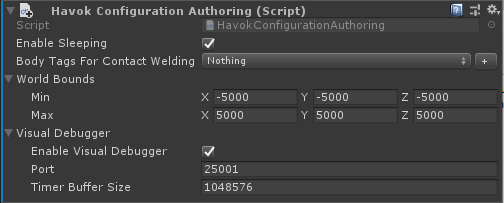

# Havok Visual Debugger

The Havok Visual Debugger (often referred to as the "VDB") is a standalone application that connects to a **Havok Physics** powered simulation over a network socket.

## Prerequisites

The Havok Visual Debugger is currently only supported on Windows and requires the following software preinstalled:
* .NET 4.6 : [Web installer](https://www.microsoft.com/en-us/download/details.aspx?id=48130) | [Offline installer](https://www.microsoft.com/en-us/download/details.aspx?id=48137)
* Microsoft Visual C++ 2017 Redistributable : [Offline installer](https://aka.ms/vs/15/release/vc_redist.x64.exe)
* DirectX End-User Runtime : [Web installer](https://www.microsoft.com/en-us/download/details.aspx?id=35) | [Offline installer](https://www.microsoft.com/en-us/download/details.aspx?id=8109)

## Quick start guide

1. Ensure software prerequisites are installed, as above.
1. Add a `Havok Configuration Authoring` component anywhere in the scene hierarchy (usually on the same node as the `PhysicsStep` component), and toggle _Enable Visual Debugger_
  
1. While a **Havok Physics** simulation is running click menu _Window > Analysis > Havok Visual Debugger_ to launch the application.
  
1. The VDB defaults to a right handed coordinate system, with a counter clockwise triangle winding. To change these to Unity's left handed system change the following settings in the "Settings" and "Camera" panels respectively.
  
1. Use the "Connect" panel to connect the VDB to your running example (on port 25001, configured through the `Havok Configuration Authoring`). You should see the physics shapes appear in the VDB. Hold the *left* mouse button to look around and WSAD to move around.
1. Toggle the various viewers provided by Havok Physics (in the "Viewers" panel) to choose what to draw. You can also grab and drag any dynamic bodies by holding the space bar while the mouse is over it.
1. Full details on how to use the VDB can be found in the manual, which can be launched from the VDB itself. See the launch button in the help menu. Note that the manual covers lots of details of how the VDB can be customised by users with full access to the Havok Physics C++ SDK, which is not applicable to most users. The section of interest for the Havok Physics DOTS is chapter 4: "Visual Debugger Application".
  
